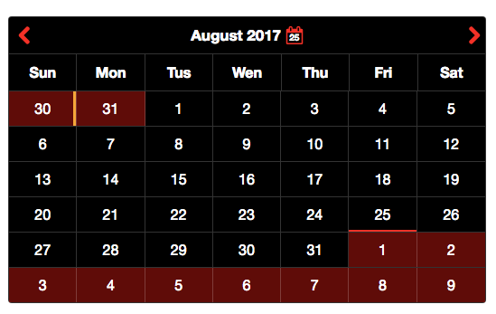
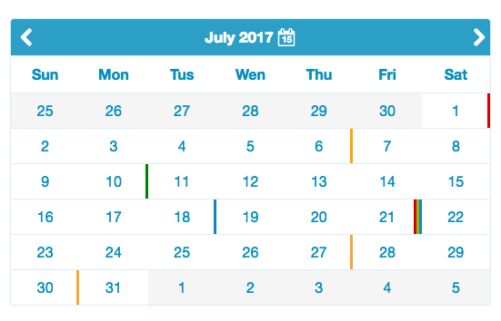

[](https://travis-ci.org/mpachnis/mp-calendar) [](https://www.webcomponents.org/element/mpachnis/mp-calendar)
  
[](https://vaadin.com/directory/component/mpachnismp-calendar)
[](https://vaadin.com/directory/component/mpachnismp-calendar)

## &lt;mp-calendar&gt;


## Demo

[mp-calendar docs & demo](https://www.webcomponents.org/element/mpachnis/mp-calendar)


## Install the component using [Bower](http://bower.io/):

```bash
$ bower install --save mp-calendar
```

## Usage

1. Import Web Components' polyfill:

```html
<script src="bower_components/webcomponentsjs/webcomponents-lite.js"></script>
```

2. Import Custom Element:

```html
<link rel="import" href="bower_components/mp-calendar/mp-calendar.html">
```

3. Start using it!
<!--
```
<custom-element-demo>
    <template>
        <script src="../webcomponentsjs/webcomponents-lite.js"></script>
        <link rel="import" href="mp-calendar.html">
        <next-code-block></next-code-block>
    </template>
</custom-element-demo>
```
-->

```html

<mp-calendar day-labels='["Su","Mo","Tu","We","Th","Fr","Sa"]'
             disable-prev-days
             show-days-in-month=42
             disabled-dates="[8, 17, 29]"
             disabled-days='["Tu"]'
             disabled-weeks="[5]"
             events-file=demo/events.json>
</mp-calendar>

```

### Themes
There are 2 additional theme to chose, a dark and a light-blue.
 

You can also customize the calendar your self with the following properties:

Property | Description
-------- | -----------
--main-bg | Calendar's main background color
--header-bg | Calendar's header background color
--main-header-color | Calendar's header color
--header-icon-bg | Calendar's icons background
--header-icon-opacity | header's icon opacity on hover event
--labels-color | The color of the days
--border-width | Calendar's border width
--border-right-width | Calendar's right border (if you set it to 0 then the dates will have top and bottom border)
--border-color | Calendar's border color
--prev-days-bg | Calendar's previous month dates background color
--prev-days-color | Calendar's previous month dates color
--curr-days-bg | Calendar's current month dates background
--curr-days-color | Calendar's current month dates color
--next-days-bg | Calendar's next month dates background
--next-days-color | Calendar's next month dates color
--disabled-color | Calendar's disabled dates color
--disabled-text-shadow | Calendar's disabled dates text shadow effect
--selected-day-bg | Calendar's selected day background color
--today-boxshadow-color | Calendar's current date shadow style, it's adding a small border style effect
--selected-day-hover-bg | Calendar's selected day background color on hover


### Events
There are 4 categories: red, blue, green, orange.
Each day which have an event will also have a color line at the right side, based on the category.
If a day have 3 or more events than the display color will be a dark grey.
Date format YYYY-MM-DD.
json example:

```html
[
    {
        "title": "Red style category",
        "content": "Skype call at 15:40",
        "date": "2017-06-02",
        "category": "red"
    },
    {
        "title": "orange style category",
        "content": "Meeting at 14:00",
        "date": "2017-06-05",
        "category": "orange"
    },
    {
        "title": "Green style category",
        "content": "Just a notification",
        "date": "2017-06-10",
        "category": "green"
    },
    {
        "title": "Blue style category",
        "content": "Doctor's appointment at 20:00",
        "date": "2017-06-18",
        "category": "blue"
    }
]
```

### Properties

Property | Type | Description | Default
-------- | ----------- | ----------- | -----------
day-labels | Array | This property can be used to localize the elements day labels. Do not change the order | Default: [Sunday, Monday, Tuesday, Wednesday, Thursday, Friday, Saturday]
disabled-dates | Array | Disable week days. Set the disabled dates. ex. disabled-dates="[4, 10, 12, 19, 30]" | None
disabled-days | Object | Disable week days. Set the disabled days. This will read the days from dayLabels. If you use custom dayLabels use the same values here. ex. if dayLabels default then disabled-days='["Monday", "Thursday"]'. if dayLabels custom then => day-labels='["Su","Mo","Tu","We","Th","Fr","Sa"]' disabled-days='["Mo", "Th"]'. | None
disabled-in-months | Array | In which month, days or weeks should be disabled. If not set the disabledDates & disabledWeeks will disabled for all months. ex. disabled-in-months="[5, 6]". The disabledDates & disabledWeeks will effective on May & June | None
disabled-weeks | Array | Disable weeks, starting from 0 to 4 for default. If showDaysInMonth = 42 then total weeks = 5 ex. disabled-weeks="[3]". This will disable the 3th week. | None
disable-prev-days | Boolean | Disable previous month days | false
events-file | String | Specify the events json file. ex. events-file="events.json" | None
first-day-of-week | Number | Set the first day of the week. Sunday is 0, Monday is 1 and so on | 0
month-labels | Array | This property can be used to localize the elements month labels. | [January, February, March, April, May, June, July, August, September, October, November, December]
show-days-in-month | Number | How many day will be visible on each month, including previous and next month days | 35


### Icons
[Designed by Designerz Base](https://www.iconfinder.com/Designerzbase)

## License

MIT License
